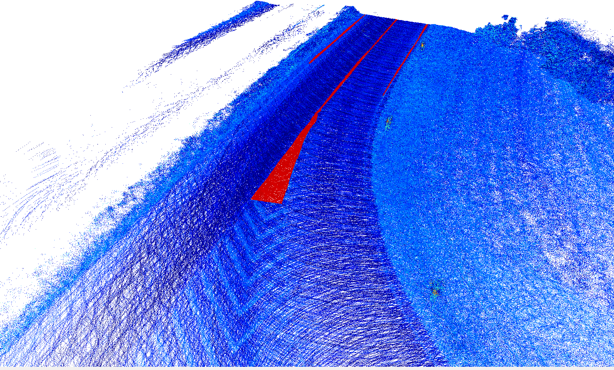
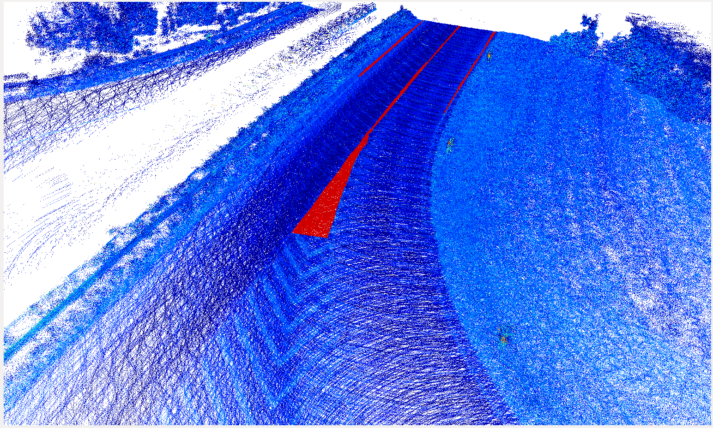
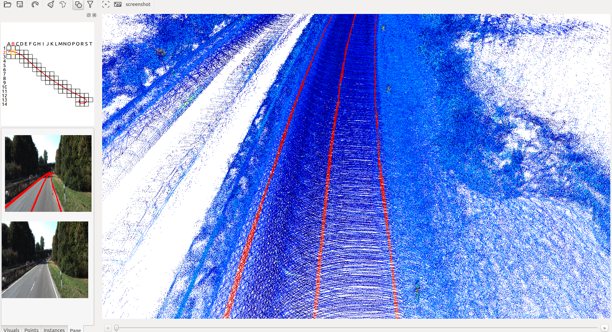
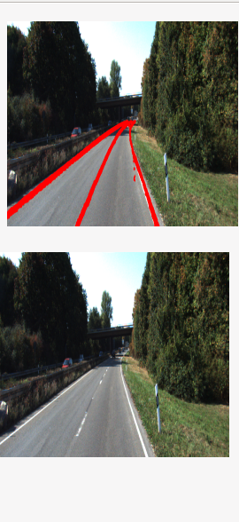

# Point Cloud Labeling Tool for Lane

这个代码是改自https://github.com/jbehley/point_labeler.git。

主要加入了以下两个功能

## 地面保留
只保留地面部分，因为车道线只在地面上，所以标注车道线的时候只需要关注地面的部分即可。目前做法是根据kitti数据集中的标签保留地面部分，后续会把randlanet网络集成进去。

**地面保留后** 

**地面保留前**

## 前视图实时显示标注情况
为了验证标注的地方是否有车道线、以及标注车道线的位置是否准确，kitti数据集提供了两个前视图摄像机拍摄到的图片，我们将标注的多帧车道线点叠加后投影到前视图上，以便验证标注的位置是否正确，同时我们提供了原始图像，可以用来比对周围环境确定该区域是否存在车道线。

**整体布局**

**tab布局**

